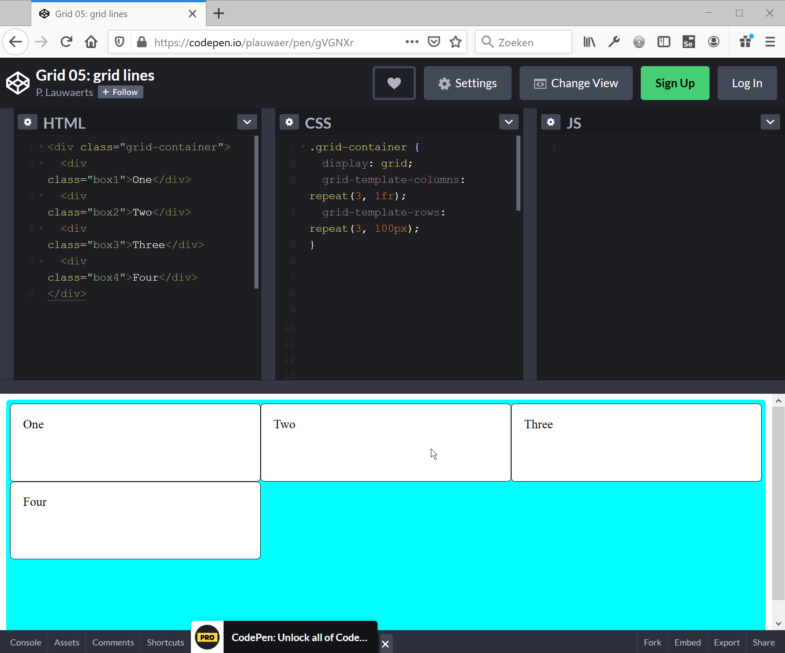

# 09SOLLayOutGrid

## Oefening 1 - Grid Layout CodePens

- [CodePen - Grid 01: grid container](https://codepen.io/plauwaer/pen/KOvGYq)
  <pre><code>.grid-container {
    display: grid;
    <del>grid-template-columns: 200px 200px 200px;</del>
    <ins>grid-template-columns: 200px 200px;</ins>
  }</code></pre>

- [CodePen - Grid 02: fr-eenheid](https://codepen.io/plauwaer/pen/ymzzjg)
  <pre><code>.grid-container {
    display: grid;
    <del>grid-template-columns: 500px 1fr 2fr;</del>
    <ins>grid-template-columns: 500px 1fr 1fr;</ins>
  }</code></pre>

- [CodePen - Grid-03: repeat()](https://codepen.io/plauwaer/pen/LYZXEpE)
  
  <pre><code>.grid-container {
    display: grid;
    <del>grid-template-columns: repeat(4, 1fr);</del>
    <ins>grid-template-columns: repeat(9, 1fr);</ins>
  }</code></pre>

- [CodePen - Grid-04: repeat()](https://codepen.io/plauwaer/pen/LYZXEpE)
  
  <pre><code>.grid-container {
    display: grid;
    <del>grid-template-columns: repeat(2,50px) repeat(3,200px);</del>
    <ins>grid-template-columns: 100px repeat(3, 1fr 2fr);</ins>
  }</code></pre>

- [CodePen - Grid-05: grid lines](https://codepen.io/plauwaer/pen/dyXQPNM)

  Firefox Grid Inspector gebruiken om de lijnnummers weer te geven van de grid container:

  
  
- [CodePen - Grid-06: position grid items with grid lines](https://codepen.io/plauwaer/pen/ZEOmYjg)

  <pre><code>.box1 {grid-column-start: 1;grid-column-end: 4;grid-row-start: 1;grid-row-end: 1;}
  .box2 {grid-column-start: 2;grid-column-end: 3;grid-row-start: 2;grid-row-end: 3;}
  .box3 {grid-column-start: 1;grid-column-end: 2;grid-row-start: 2;grid-row-end: 4;}
  .box4 {grid-column-start: 3;grid-column-end: 4;grid-row-start: 2;grid-row-end: 4;}
  </code></pre>

- [CodePen - Grid-07: position grid items with grid-column en grid-row](https://codepen.io/plauwaer/pen/MWezYVR)
  <pre><code>.box1 {
    grid-column: 1/4;
    grid-row: 1;
  }
  .box2 {
    grid-column: 2;    
    grid-row: 2;
  }
  .box3 {
    grid-column:1;
    grid-row: 2/4;
  }
  .box4 {
    grid-column: 3;
    grid-row: 2/-1;
  }
  </code></pre>  

- [CodePen - Grid-08: position grid items with grid-column, grid-row en span](https://codepen.io/plauwaer/pen/vYKQEQJ)
  <pre><code>.box1 {
    grid-column: 1/span 3;
    grid-row: 1;
  }
  .box2 {
    grid-column: 2;    
    grid-row: 2;
  }
  .box3 {
    grid-column:1;
    grid-row: 2/span 2 ;
  }
  .box4 {
    grid-column: 3;
    grid-row: 2/span 2;
  }</code></pre>

- [CodePen - Grid-09: grid-template-areas](https://codepen.io/plauwaer/pen/VwjVLay)

  <pre><code> grid-template-areas: 
    "one   one   one"
    "three two   four"
    "three .     four";
  </code></pre>

